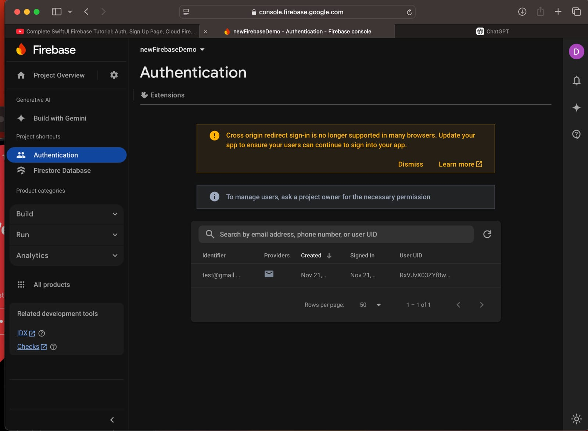
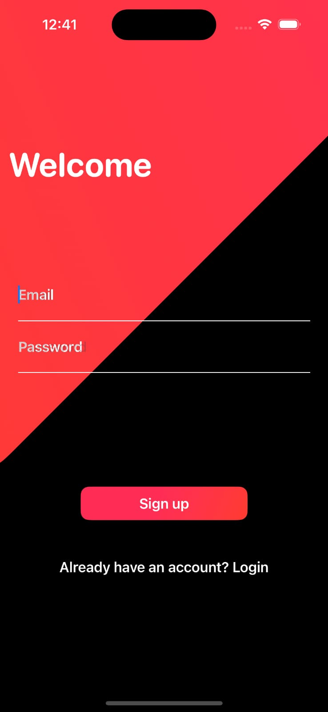
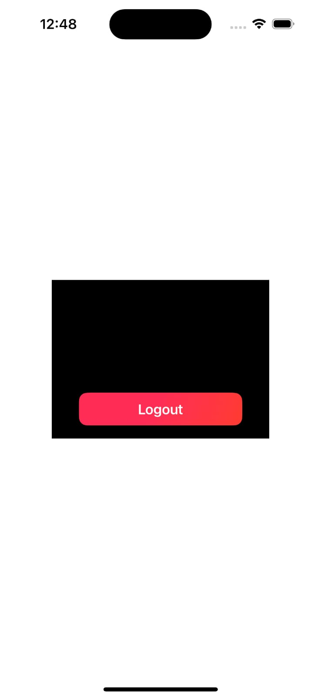

# Firebase Authentication in SwiftUI

This project demonstrates how to implement Firebase Authentication using SwiftUI. Users can sign up, log in, and log out using a simple user interface integrated with Firebase Authentication services.

## Features
- User sign-up with email and password.
- User log-in functionality.
- User log-out functionality.
- Integrated with Firebase Authentication.

## Prerequisites
1. **Firebase Project**: Set up a Firebase project in the [Firebase Console](https://console.firebase.google.com/).
2. **iOS Setup**: Download the `GoogleService-Info.plist` file from your Firebase project and add it to your Xcode project.
3. **SwiftUI**: This project uses SwiftUI for building the user interface.

## Getting Started
1. Clone this repository to your local machine.
2. Open the project in Xcode.
3. Add your `GoogleService-Info.plist` file to the project.
4. Install the Firebase SDK in your project using CocoaPods or Swift Package Manager:
   ```bash
   pod install
5. Run the project on a simulator or a physical device.

## Authentication Console in Firebase
This is the Firebase console showing a successfully registered user:


## Sign-Up Screen
Users can sign up by entering their email and password:


## Log-In Screen
Users can log in with their credentials:


## Log-Out Screen
After logging in, users can log out using this screen:


## How It Works
**Sign-Up**
User enters their email and password.
The app interacts with Firebase Authentication API to create a new user.
Upon successful registration, the user is directed to the home screen.
**Log-In**
User enters their credentials.
Firebase Authentication verifies the credentials.
Upon successful login, the user can access the home screen.
**Log-Out**
User taps the "Logout" button.
The app calls the Firebase sign-out method to log the user out.

## Dependencies
**Firebase SDK**: Used for authentication.
**SwiftUI**: For the user interface.
**Xcode 14 or higher**: Recommended for compatibility.

